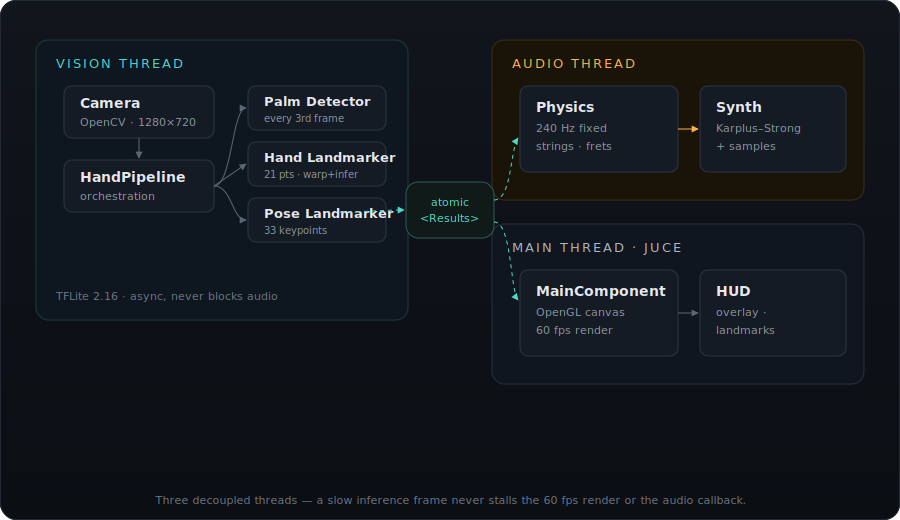
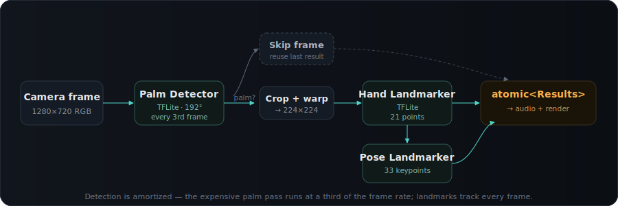

<div align="center">



<br>

[](#)
[](#)
[](#)
[](#)
[](#)

### Play guitar with nothing in your hands.

A webcam watches your hands, a physics model turns your motion into vibrating strings, and a Karplus–Strong synth turns those strings into sound — end to end in C++, targeting **under 15 ms** from camera frame to audio out on Apple Silicon.

**[Quick Start](#quick-start)** · **[How It Works](#how-it-works)** · **[Roadmap](#roadmap)** · **[Status](#status)** · **[Tech Stack](#tech-stack)**

</div>

---

## How it works

Three pieces, three threads, one rule: a slow vision frame must never stall the render or the audio callback.

| Step | What happens |
| --- | --- |
| 👁️ **See** | A webcam frame runs through MediaPipe's palm, hand, and pose models (TensorFlow Lite) to recover 21 hand landmarks and 33 body keypoints. |
| 🤚 **Feel** | A 240 Hz physics loop reads those landmarks as plucks, fret presses, and a strumming arm. |
| 🔊 **Hear** | A Karplus–Strong string model, with a sample layer on top, renders the result into audio. |

---

## Architecture

The vision pipeline, the audio engine, and the JUCE render loop each run on their own thread. They communicate through a single lock-free snapshot of the latest tracking results — so inference can hitch without ever dropping a frame or glitching the sound.

<div align="center">

</div>

---

## Vision pipeline

Hand detection is expensive, so it's amortized: the palm detector runs once every three frames, and when it finds a hand the landmark models track it every frame. No palm, no work — the last good result is reused.

<div align="center">

</div>

---

## Roadmap

AirGuitar starts as a solo instrument. It won't stay that way.

### 🎧 Play along with Spotify & YouTube

The idea: point AirGuitar at whatever's already playing — a song on Spotify, a live stream on YouTube, anything coming out of your speakers — and jam over it like it's your own backing track.

| Feature | What it does |
| --- | --- |
| **Ambient audio capture** | Taps system audio output (no file import needed) so any app can be the backing track. |
| **Live BPM + key detection** | Analyzes the captured stream in real time to lock the physics engine's timing and the string tuning to the song. |
| **Chord-aware fretboard hints** | Overlays suggested chords/scales on screen as the song progresses, so you always know where to put your hands. |
| **Auto-mix ducking** | Gently ducks the backing track under your strums so your playing stays audible without killing the song. |

### 🎸 Jam with friends, on other instruments

The longer-term idea: turn AirGuitar into AirBand — everyone air-plays a different instrument, and it all comes together in real time.

| Feature | What it does |
| --- | --- |
| **Multi-user sessions** | Each person joins from their own camera/machine; a shared low-latency session keeps everyone in sync. |
| **New instrument models** | Bass, drums (via arm/stick tracking), and keys, each with their own gesture vocabulary layered on the existing hand-pose pipeline. |
| **Shared clock** | One tempo/key source (from a song, a leader, or a click) so every instrument locks together instead of drifting. |
| **Session recording** | Bounce a jam down to a shareable audio (or MIDI) file afterward. |

> These are the two big swings on the horizon — not yet started, but they're what the current single-player, single-instrument architecture is being built to grow into.

---

## Quick start

> **Requirements:** macOS 14+ (Sonoma) · Xcode 16+ command-line tools · CMake 3.24+ · Homebrew

```bash
# 1. System dependency
brew install opencv

# 2. Clone
git clone https://github.com/clefspear/AirGuitar.git
cd AirGuitar

# 3. Fetch the TFLite models
./scripts/setup.sh

# 4. Configure + build
cmake --preset debug
cmake --build --preset debug

# 5. Run
./build/debug/src/AirGuitar.app/Contents/MacOS/AirGuitar
```

The first build takes **3–5 minutes** — it compiles TensorFlow Lite from source via `FetchContent`. Subsequent builds reuse the cache in `~/.cache/`.

**Run the tests:**

```bash
ctest --preset debug
```

---

## Status

| Subsystem | State |
| --- | --- |
| Hand + pose tracking (TFLite) | ✅ Working |
| Threaded capture / inference / audio | ✅ Working |
| Karplus–Strong string synthesis | ✅ Working |
| 240 Hz physics (strings, fret detection, chord classification) | ✅ Working |
| MIDI output | ✅ Working |
| Calibration wizard (full + quick) | ✅ Working |
| Crash logging | ✅ Working |
| One Euro filter (jitter smoothing) | ✅ Working |
| 88 tests, 280 assertions | ✅ All passing |
| Spotify / YouTube play-along mode | 🔜 Planned |
| Multi-user jam sessions | 🔜 Planned |

---

## Configuration

| Setting | Default | Notes |
| --- | --- | --- |
| Camera resolution | 1280×720 @ 60 fps | Matches the MediaPipe training resolution |
| Inference rate | Variable (async) | Palm every 3rd frame, hand landmarks every frame |
| Model format | TFLite (FP32) | MediaPipe models fetched from `storage.googleapis.com` |

Model URLs live in `cmake/FetchModels.cmake`; the models land in `models/*.tflite`.

---

## Project layout

```
AirGuitar/
├─ CMakeLists.txt            # root build
├─ CMakePresets.json         # debug / release presets
├─ cmake/                    # FetchJUCE, FetchTFLite, FetchModels, warnings
├─ src/
│  ├─ main.cpp
│  ├─ App/                   # JUCE shell — Application, MainComponent, CrashLogger
│  ├─ Vision/                # Camera, TFLiteRuntime, Palm/Hand/Pose,
│  │                         #   HandPipeline, LandmarkData
│  ├─ Physics/               # OneEuroFilter, FretboardTracker, StrumDetector,
│  │                         #   ChordClassifier, PhysicsEngine
│  ├─ Audio/                 # KarplusStrong, StringModel, AudioEngine, MidiOutput
│  └─ Calibration/           # CalibrationManager, CalibrationData
├─ tests/                    # 88 test cases across 9 test files
├─ scripts/                  # setup.sh, download_models.sh
├─ models/                   # .tflite files (downloaded)
└─ resources/                # guitar samples (user-provided)
```

---

## Tech stack

| | |
| --- | --- |
| **Inference** | TensorFlow Lite 2.16.1 — built from source via FetchContent |
| **Vision** | OpenCV 4.13 — capture + preprocessing |
| **App / audio / GL** | JUCE 8 |
| **Tests** | Catch2 3.6 |
| **Build** | CMake + FetchContent |

---

## License

[Apache 2.0](LICENSE)
